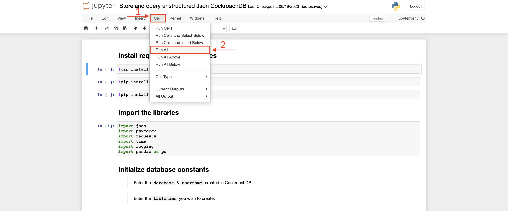

---
#Front matter (metadata).

authors:
 - name: "Srikanth Manne"
   email: "srikanth.manne@in.ibm.com"
 - name: "Manoj Jahgirdar"
   email: "manoj.jahgirdar@in.ibm.com"
 - name: "Rahul Reddy Ravipally"
   email: "raravi86@in.ibm.com"
 - name: "Manjula G. Hosurmath"
   email: "mhosurma@in.ibm.com"

completed_date: 2020-09-21
check_date: 2021-09-21

draft: true

excerpt: In this tutorial, learn how to perform DML operations with CockroachDB hosted on Red Hat® Marketplace using the Python runtime and a Jupyter notebook.

abstract: In this tutorial, learn how to perform DML operations with CockroachDB hosted on Red Hat® Marketplace using the Python runtime and a Jupyter notebook.

meta_keywords: 'CockroachDB operator, Red hat Marketplace

related_content: 
  - type: tutorials
    slug: get-started-using-a-cockroachdb-operator-hosted-on-red-hat-marketplace
  - type: tutorials
    slug: store-and-query-unstructured-json-data-using-cockroachdb-hosted-on-rhm
  - type: patterns
    slug: build-library-management-system-cockroachdb-red-hat-marketplace

meta_keywords: 'CockroachDB operator, Red hat Marketplace'

primary_tag: databases

tags:
  - databases
  - containers

related_links:
  - title: '"CockroackDB on Red Hat Marketplace'
    url: 'https://marketplace.redhat.com/en-us/products/cockroachdb-operator'
  - title: Red Hat Marketplace
    url: '"https://marketplace.redhat.com/'

collections:
  - "red-hat-marketplace"

subtitle: Perform DML Operations with CockroachDB hosted on Red Hat Marketplace
title: Perform DML Operations with CockroachDB
meta_title: Perform DML Operations with CockroachDB hosted on Red Hat Marketplace

---

In this tutorial, learn how to perform DML operations with CockroachDB hosted on Red Hat® Marketplace using the Python runtime and a Jupyter notebook. 
[CockroachDB](https://marketplace.redhat.com/en-us/products/cockroachdb-operator) is an elastic SQL database that easily scales transactions for your apps and services.

## Learning objectives

When you have completed this tutorial, you will understand how to:

* Install a CockroachDB Operator from Red Hat Marketplace on a OpenShift Cluster
* Create a CockroachDB cluster instance
* Create a user and database in CockroachDB
* Perform DML operations on CockroachDB
* Manage a CockroachDB cluster from the Cluster Overview page <--EM: in the RH OpenShift console?-->

## Estimated time

Completing this tutorial should take about 30 minutes.

## Pre-requisites

1. [Red Hat Marketplace Account](https://marketplace.redhat.com/en-us/registration/om).
2. [Red Hat OpenShift Cluster](https://cloud.ibm.com/kubernetes/catalog/create?platformType=openshift). 
3. [OpenShift container & kubectl CLI](https://docs.openshift.com/container-platform/3.6/cli_reference/get_started_cli.html).
4. Access to a Jupyter Notebook. You can [install a Jupyter Notebook from python-pip](https://jupyter.org/install) or use a tool such as [Anaconda](https://www.anaconda.com/products/individual) to open the Jupyter Notebook.

## Steps

### Step 1: Install the CockroachDB Operator from Red Hat Marketplace on OpenShift Cluster

Follow the steps in this tutorial to deploy a CockroachDB Operator from Red Hat Marketplace on an OpenShift Cluster:
  - [Get started using a CockroachDB Operator hosted on Red Hat Marketplace](https://developer.ibm.com/tutorials/get-started-using-a-cockroachdb-operator-hosted-on-red-hat-marketplace/)

Once you have successfully set up a CockroachDB Operator on an OpenShift Cluster you can create a database.


### Step 2: Create a database in CockroachDB

Now, let's create a `user` and a `database`.

1. Run the following command to spin up a CockroachDB client:

    ```bash
    $ kubectl run -it --rm cockroach-client \
    --image=cockroachdb/cockroach \
    --restart=Never \
    --command -- \
    ./cockroach sql --insecure --host=example-cockroachdb-public.cockroachdb-test
    ```

    This should run the CockroachDB client and take you to a `SQL Command Prompt` as shown. If you don't see a command prompt, try pressing Enter.

    ```bash
    root@example-cockroachdb-public.cockroachdb-test:26257/defaultdb>
    ```

1. From the CockroachDB client, run the following commands:

    * Create a user `maxroach` as follows:
      <pre><code>root@example-cockroachdb-public.cockroachdb-test:26257/defaultdb> <b>CREATE USER IF NOT EXISTS maxroach;</b>
      CREATE USER 1

      Time: 9.580878ms
      </code></pre>
  
    * Create a database `bank` as follows:
      <pre><code>root@example-cockroachdb-public.cockroachdb-test:26257/defaultdb> <b>CREATE DATABASE bank;</b>
      CREATE DATABASE

      Time: 14.449525ms
      </code></pre>
  
    * Give our user, `maxroach`, permission to update our database, `bank` as follows:
      <pre><code>root@example-cockroachdb-public.cockroachdb-test:26257/defaultdb> <b>GRANT ALL ON DATABASE bank TO maxroach;</b>
      GRANT
  
      Time: 9.308095ms
      </code></pre>
  
    At this point, you should have a `user` and a `database`.

    * Type `\q` to quit the client console as shown:
    <pre><code>root@example-cockroachdb-public.cockroachdb-test:26257/defaultdb> <b>\q</b>
      pod "cockroach-client" deleted
      $
      </code></pre>

### Step 3: Access the admin console on your localhost

The following steps show you how to view the results of the commands you ran in the earlier steps via the `admin console`. You can access the console at localhost with port forwarding.

> Note: You need to be logged in to your OpenShift Cluster with the OC login that you accessed in [Step 2: Connect to the OpenShift cluster in your CLI](https://developer.ibm.com/tutorials/get-started-using-a-cockroachdb-operator-hosted-on-red-hat-marketplace/#2-connect-to-the-openshift-cluster-in-your-cli).

1. Run the following command to port forward `8080`:

    ```bash
    $ kubectl port-forward example-cockroachdb-0 8080
    ```

    ```
    Forwarding from 127.0.0.1:8080 -> 8080
    Forwarding from [::1]:8080 -> 8080
    ```

1. Visit <http://localhost:8080> on your browser as shown. The page should load the cluster overview.

    

1. Click on `databases` to view the `employees` database that you created earlier.

    

### Step 4: Perform DML operations on CockroachDB using python runtime and Jupyter Notebook

Once you have the CockroachDB up and running and your user and database created, you can now perform DML Operations on CockroachDB in a Python runtime using a Jupyter Notebook.

1. In your terminal, run the following command to port forward the `26257` port from the CockroachDB database instance. You will use this port in your Jupyter Notebook to establish a connection with the CockroachDB database instance.

    ```bash
    $ kubectl port-forward example-cockroachdb-0 26257
    ```

    ```
    Forwarding from 127.0.0.1:26257 -> 26257
    Forwarding from [::1]:26257 -> 26257
    ```

1. Download and open the following Jupyter notebook [dml-operations-with-cockroachdb.ipynb](dml-operations-with-cockroachdb.ipynb) in your local machine.

1. Select the **Cell** tab and click **Run All**.

    

    Follow the notebook instructions for more details on what is happening in each cell.

    After you execute the notebook, from your terminal, verify the table in the ClockroachDB instance through the CockroachDB client.

1. In your terminal, run the following command to spin up a CockroachDB client:

    ```bash
    $ kubectl run -it --rm cockroach-client \
    --image=cockroachdb/cockroach \
    --restart=Never \
    --command -- \
    ./cockroach sql --insecure --host=example-cockroachdb-public.cockroachdb-test
    ```

1. This should run the CockroachDB client and take you to a `SQL Command Prompt` as shown. If you don't see a command prompt, press **Enter**.

    ```bash
    root@example-cockroachdb-public.cockroachdb-test:26257/defaultdb>
    ```

1. From the CockroachDB client, run the following commands to view `user`, `database` and `table` which was created with the Jupyter Notebook:

    * View `users` by running the `SHOW users;` command:
    
      <pre><code>root@example-cockroachdb-public.cockroachdb-test:26257/defaultdb> <b>SHOW users;</b>
       user_name
      `-------------`
        cpuser
        <b>maxroach</b>
        root
      (3 rows)

      Time: 3.037641ms
      </code></pre>

 1. View `databases` by running the `SHOW databases;` command as follows:
  
    <pre><code>root@example-cockroachdb-public.cockroachdb-test:26257/defaultdb> <b>SHOW databases;</b>
    database_name
    `-----------------`
    <b>bank</b>
    defaultdb
    postgres
    system
    (4 rows)

    Time: 2.890031ms</code></pre>

1. To view the tables present in `bank` database, run the `USE bank;` command to switch to `bank` database. Run `\d` command to view the `tables` as follows:
 
    <pre><code>root@example-cockroachdb-public.cockroachdb-test:26257/defaultdb> <b>USE bank;</b>
    SET

    Time: 11.83841ms

    root@example-cockroachdb-public.cockroachdb-test:26257/bank> <b>\d</b>
    table_name
    `----------------------`
    <b>accounts</b>
    jsontbl
    test_bank_customer
    (3 rows)

    Time: 3.684617ms</code></pre>

1. Finally, to view the accounts table, use the `SELECT` command:
    
    <pre><code>root@example-cockroachdb-public.cockroachdb-test:26257/defaultdb> <b>SELECT * from accounts;</b>
   </code></pre>


# Summary

This tutorial showed you how to perform DML operations on CockroachDB Operator using python runtime and Jupyter Notebook.

# Reference

You can refer the following documentation from [Cockroach labs](https://www.cockroachlabs.com) to learn more about the operator and its features.
  - https://www.cockroachlabs.com/docs/stable/demo-json-support.html
